# SELinux Access Control: Securing Apache on Fedora

## Overview

This project explores **Security-Enhanced Linux (SELinux)** as a Mandatory Access Control (MAC) framework layered on top of traditional Linux Discretionary Access Control (DAC). The objective was to configure and secure an Apache web server on a Fedora system with SELinux in enforcing mode — a scenario commonly encountered in enterprise Red Hat environments.

The project covers five core areas: port policy modification, TLS certificate management, file context labeling, SELinux user role transitions, and user directory content serving — each demonstrating how SELinux's type enforcement, role-based access control, and boolean toggles work together to enforce the principle of least privilege.

---

## How SELinux Enforces Access Control

SELinux operates as a second layer of access control that runs *after* standard Linux DAC checks. Even if DAC (file permissions) would allow an action, SELinux can still deny it based on its own policy rules. Every process and file on the system is assigned a **security context** consisting of four fields:

```
user:role:type:level
│      │     │     └─ MLS/MCS sensitivity level
│      │     └─────── Type (primary enforcement mechanism)
│      └───────────── Role (controls type transitions)
└──────────────────── SELinux user identity
```

The **type** field is the most critical component in the targeted policy. SELinux's type enforcement rules define which process types (domains) can access which file types. For example, the `httpd_t` domain can read `httpd_sys_content_t` files but cannot read `user_home_t` files — regardless of Unix permissions.

```mermaid
flowchart TD
    A["Process Request\n(e.g., Apache reads index.html)"] --> B{"DAC Check\n(Unix Permissions)"}
    B -->|"Denied"| C["❌ Access Denied\n(Permission Error)"]
    B -->|"Allowed"| D{"SELinux MAC Check\n(Type Enforcement)"}
    D -->|"Source type allowed\nto access target type?"| E{"Policy Lookup"}
    E -->|"httpd_t → httpd_sys_content_t ✅"| F["✅ Access Granted"]
    E -->|"httpd_t → user_home_t ❌"| G["❌ Access Denied\n(403 Forbidden)\nAVC Denial Logged"]
    D -->|"SELinux Disabled\nor Permissive"| H["⚠️ Access Allowed\n(Logged if Permissive)"]
```



---

## Task 1: Changing the httpd Port Policy

### The Problem

After changing Apache's listening port from the default TCP 80 to **TCP 10XXX** (derived from the specific number) in `/etc/httpd/conf/httpd.conf`, the service failed to restart with a "Permission denied" error on bind.

### Why SELinux Blocked It

SELinux uses **type enforcement on network ports** just as it does on files. The `httpd_t` domain is only permitted to bind to ports labeled `http_port_t`. Port 10XXX carries the `unreserved_port_t` label by default, so SELinux denied the bind operation — even though DAC would have allowed it.

```
# Before: Port 10XXX is NOT in the allowed list
$ sudo semanage port -l | grep http_port_t
http_port_t    tcp    80, 81, 443, 488, 8008, 8009, 8443, 9000
```

### The Fix

```bash
# Add port 10XXX to the http_port_t type
$ sudo semanage port -a -t http_port_t -p tcp 10XXX

# Update firewall rules
$ sudo firewall-cmd --add-port=10XXX/tcp --permanent
$ sudo firewall-cmd --reload

# Restart Apache
$ sudo systemctl restart httpd
```

```
# After: Port 10XXX now appears in the allowed list
$ sudo semanage port -l | grep http_port_t
http_port_t    tcp    10XXX, 80, 81, 443, 488, 8008, 8009, 8443, 9000
```

### Key Takeaway

SELinux extends access control to the network layer. A confined process can only bind to ports explicitly allowed by its type enforcement policy, adding defense-in-depth beyond what firewalls alone provide.

---

## Task 2: Enabling HTTPS with Self-Signed Certificates

### Certificate Generation

A self-signed certificate was generated using **ECDSA with the P-384 curve** (secp384r1), providing strong asymmetric security with efficient key sizes:

```bash
$ sudo openssl req -x509 -nodes -days 365 \
    -newkey ec -pkeyopt ec_paramgen_curve:secp384r1 \
    -keyout /etc/pki/tls/private/server.key \
    -out /etc/pki/tls/certs/server.crt
```

### File Placement and SELinux Context

The certificate and key were placed in Red Hat's standard TLS directories, which have pre-defined SELinux file context rules:

| File | Path | Permissions | SELinux Type | Rationale |
|------|------|-------------|--------------|-----------|
| Certificate | `/etc/pki/tls/certs/server.crt` | `644` | `cert_t` | Public data shared during TLS handshake |
| Private Key | `/etc/pki/tls/private/server.key` | `600` | `cert_t` | Sensitive key material — owner-only access |

Files created directly in these directories **automatically inherit** the `cert_t` type, which the `httpd_t` domain is permitted to read when loading TLS materials. No manual context changes were required.

### TLS Connection Result

The HTTPS connection negotiated **TLS 1.3** with `TLS_AES_256_GCM_SHA384` for symmetric encryption and `x25519` for ephemeral key exchange, providing both strong confidentiality and perfect forward secrecy.

---

## Task 3: SELinux Context for Web Content

This task demonstrates one of the most common SELinux pitfalls in production environments: the difference between `mv` and `cp` when placing files in web-accessible directories.

### The Experiment

An `index.html` file was created in the home directory and **moved** (not copied) to `/var/www/html/`:

```bash
$ mv index.html /var/www/html/index.html
$ curl http://localhost:10429
# Result: 403 Forbidden
```

### Root Cause Analysis

The `mv` command performs a **filesystem-level rename**, preserving the original SELinux context. The file retained its `user_home_t` label from the home directory. Apache (`httpd_t`) has no policy permission to read `user_home_t` files.

```bash
# The file kept its home directory context after mv
$ ls -lZ /var/www/html/index.html
-rw-r--r--. 1 en1 en1 unconfined_u:object_r:user_home_t:s0 ... index.html
```

The AVC denial log confirmed the block:

```
type=AVC msg=audit(...): avc: denied { read } for pid=960
  comm="httpd" name="index.html"
  scontext=system_u:system_r:httpd_t:s0          ← Apache's domain
  tcontext=unconfined_u:object_r:user_home_t:s0  ← Wrong file type
```


### The Fix

```bash
$ sudo restorecon -v /var/www/html/index.html
# Relabeled: user_home_t → httpd_sys_content_t
```

`restorecon` applies the correct context based on SELinux's default file-context rules for that directory path. This is preferred over `chcon` because it persists across policy reapplications.

### Key Takeaway

Always use `restorecon` after moving files into SELinux-protected directories. Alternatively, use `cp` instead of `mv` — copied files inherit the context of their destination directory.

---

## Task 4: SELinux Role-Based Access Control (RBAC)

This task demonstrates SELinux's RBAC by creating a confined user that can transition to a web administration role via `sudo`.

### Configuration Steps

```bash
# 1. Create the SELinux user with allowed roles
$ sudo semanage user -a -R "staff_r webadm_r system_r" cy5130_u

# 2. Create Linux user mapped to the SELinux user
$ sudo useradd -Z cy5130_u en2

# 3. Relabel the home directory
$ sudo restorecon -RvF /home/en2

# 4. Configure sudoers for role transition
# /etc/sudoers.d/en2-webadm (permissions: 440)
en2 ALL=(ALL) TYPE=webadm_t ROLE=webadm_r /bin/sh
```

### The Role Transition in Action

```bash
# Before sudo — default staff role
[en2@localhost]$ id -Z
cy5130_u:staff_r:staff_t:s0

# After sudo /bin/sh — transitions to webadm
sh-5.2# id -Z
cy5130_u:webadm_r:webadm_t:s0
```

The SELinux user (`cy5130_u`) remains constant — only the **role** and **type** change. This follows the principle of least privilege: `en2` gains web administration capabilities without obtaining unconfined root access.

```mermaid
flowchart TD
    subgraph LOGIN ["SSH Login as en2"]
        A["cy5130_u : staff_r : staff_t : s0\n👤 General-purpose confined user"]
    end
    subgraph SUDO ["sudo /bin/sh"]
        B["Sudoers Rule:\nTYPE=webadm_t ROLE=webadm_r /bin/sh"]
    end
    subgraph TRANSITION ["New Shell Context"]
        C["cy5130_u : webadm_r : webadm_t : s0\n🔧 Web administration domain"]
    end
    A -->|"sudo /bin/sh"| B
    B -->|"Role + Type transition"| C
```



---

## Task 5: User Directory Content with SELinux

The final task configures Apache to serve content from a user's `public_html` directory, requiring a different SELinux type than system web content.

### Apache Configuration

In `/etc/httpd/conf.d/userdir.conf`:
- Changed `UserDir disabled` → `UserDir public_html`
- Uncommented the `<Directory "/home/*/public_html">` block with `Require all granted`

### SELinux Configuration

Two changes were required — a **file context** and a **boolean**:

```bash
# 1. Label public_html with the user web content type
$ sudo semanage fcontext -a -t httpd_user_content_t "/home/en2/public_html(/.*)?"
$ sudo restorecon -Rv /home/en2/public_html

# 2. Enable the boolean that allows Apache to access home directories
$ sudo setsebool -P httpd_enable_homedirs on
```

### Why `httpd_user_content_t` Instead of `httpd_sys_content_t`?

| Type | Purpose | Location |
|------|---------|----------|
| `httpd_sys_content_t` | System-managed web content | `/var/www/html/` |
| `httpd_user_content_t` | User-published web content | `~/public_html/` |
| `user_home_t` | Regular home directory files | `~/` |

SELinux provides fine-grained differentiation between system content and user content. The `httpd_user_content_t` type is specifically designed for user-published web pages and requires the `httpd_enable_homedirs` boolean to be enabled — an extra administrative gate that ensures user home directory access is an intentional configuration choice.

### Result

```bash
# System content served from /var/www/html/
$ curl http://localhost:10XXX
→ "I am ..enmong... and this is my SELINUX Project on date ..Feb 15 2026.."

# User content served from /home/en2/public_html/
$ curl http://localhost:10XXX/~en2/
→ "Hello from user en2."
```

---

## Summary of SELinux Mechanisms Used

| Mechanism | Tool/Command | Example from This Project |
|-----------|-------------|--------------------------|
| Port labeling | `semanage port` | Added TCP 10XXX to `http_port_t` |
| File context | `restorecon`, `semanage fcontext` | Relabeled web content and user directories |
| Type enforcement | Automatic (policy) | `httpd_t` blocked from reading `user_home_t` |
| Role transitions | `sudoers` with `TYPE=` / `ROLE=` | `staff_t` → `webadm_t` via `sudo` |
| Booleans | `setsebool` | Enabled `httpd_enable_homedirs` |
| AVC auditing | `ausearch -m avc` | Diagnosed 403 errors from context mismatches |

---

## Tools & Environment

- **OS:** Fedora 42 (ARM/aarch64)
- **Web Server:** Apache httpd 2.4
- **TLS:** OpenSSL with ECDSA P-384, TLS 1.3
- **SELinux:** Targeted policy, enforcing mode
- **Key Utilities:** `semanage`, `restorecon`, `setsebool`, `ausearch`, `firewall-cmd`
